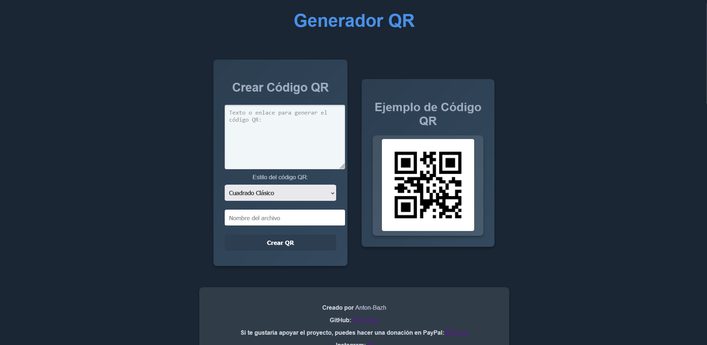
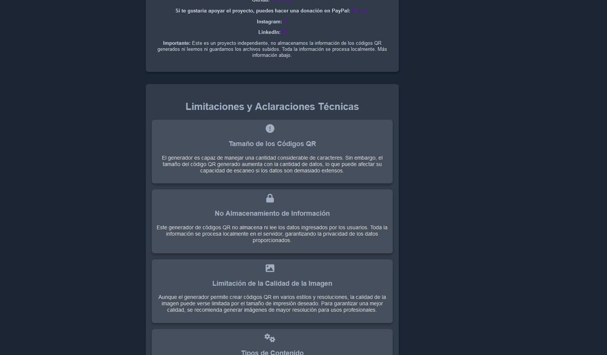

# QR-Generador-Web

El proyecto **QR-Generador-Web** es una aplicación web diseñada para que los usuarios puedan generar códigos QR personalizados de manera rápida y eficiente. La aplicación se enfoca en la simplicidad y la privacidad, ya que las imágenes generadas no se almacenan en el servidor, sino que se manejan en el caché y se envían como una imagen base64 para su descarga.

---

## Características Principales

- **Generación Personalizada**: Permite personalizar el estilo de los módulos del QR (círculos, cuadrados, barras, entre otros).
- **Privacidad Garantizada**: Las imágenes generadas no se almacenan en el servidor.
- **Interfaz Amigable**: Diseño intuitivo para una experiencia de usuario fluida.
- **Optimización de Recursos**: Manejo eficiente de imágenes mediante cadenas base64.
- **Compatibilidad**: Desplegable localmente o en plataformas en la nube como Heroku.

---

## Tecnologías Utilizadas

- **Backend**:
  - Flask: Framework ligero y flexible para la creación de aplicaciones web en Python.
  - qrcode: Librería de Python para la generación de códigos QR con estilos avanzados.
- **Frontend**:
  - HTML5, CSS3 y JavaScript: Para el diseño y la interactividad de la interfaz de usuario.
- **Despliegue**:
  - Heroku *(opcional)*: Plataforma en la nube para el despliegue de aplicaciones.
- **Otros**:
  - Gunicorn: Servidor WSGI para ejecutar aplicaciones Flask en producción.

---

## Instalación

Sigue estos pasos para configurar el proyecto en tu máquina local:

1. **Clonar el repositorio**:
   ```bash
   git clone https://github.com/Anton-Bazh/QR-Generador-Web.git
   ```

2. **Crear un entorno virtual** *(opcional pero recomendado)*:
   ```bash
   python -m venv env
   source env/bin/activate   # Para sistemas Unix
   env\Scripts\activate    # Para Windows
   ```

3. **Instalar dependencias**:
   Asegúrate de tener Python y pip instalados. Luego, instala las dependencias desde el archivo `requirements.txt`:
   ```bash
   pip install -r requirements.txt
   ```

4. **Configurar variables de entorno**:
   Si necesitas configuraciones específicas, crea un archivo `.env` para definir variables como `FLASK_ENV` o claves de API.

5. **Ejecutar la aplicación**:
   ```bash
   python app.py
   ```
   Accede a la aplicación desde tu navegador en `http://127.0.0.1:5000`.

---

## Detalles Técnicos y Flujo del Proyecto

### Flask como Framework Web

Flask se encarga de manejar las rutas y las solicitudes HTTP. Las rutas principales incluyen:

- `/`: Muestra la página principal con el formulario para ingresar texto y personalizar el QR.
- `/crear_qr`: Procesa los datos del formulario, genera el código QR y devuelve la imagen como una cadena base64.

### Generación del Código QR

El sistema utiliza la librería `qrcode` junto con `qrcode.image.styles.moduledrawers` para aplicar estilos personalizados a los módulos del código QR. Esto incluye opciones como:

- **Círculos**
- **Cuadrados**
- **Barras horizontales**

La imagen generada se convierte a formato base64, eliminando la necesidad de almacenamiento en el servidor y mejorando la privacidad.

### Despliegue en Heroku

Para desplegar el proyecto en Heroku, asegúrate de incluir los siguientes archivos:

- **Procfile**:
  ```text
  web: gunicorn app:app
  ```
- **runtime.txt**:
  ```text
  python-3.9.6
  ```

---

## Funcionalidades Adicionales

- **Compatibilidad con Dispositivos Móviles**: Interfaz adaptable para ser utilizada en smartphones y tablets.
- **Historial Local** *(opcional)*: Almacena temporalmente los últimos códigos QR generados en el navegador del usuario usando localStorage.
- **Soporte Multilingüe**: Posibilidad de agregar traducciones para ampliar el alcance de la aplicación.

---

## Imágenes del Proyecto

Ejemplos de pantallas del proyecto:

  
  

---

## Futuras Mejoras

- **Opciones de Exportación**: Permitir exportar los códigos QR en formatos adicionales como SVG o PDF.
- **Estilos Avanzados**: Incorporar degradados y colores personalizados en los códigos QR.
- **Analítica de Uso**: Añadir métricas para rastrear la frecuencia y popularidad de estilos generados.

---

## 🎉 Créditos y Contacto

Este proyecto fue desarrollado con ❤️ por [Antonio Baeza T.](https://github.com/Anton-Bazh). Si tienes alguna pregunta, sugerencia o simplemente quieres saludar, ¡estoy a tu disposición!

### 📱 Encuéntrame en:

- **GitHub**: [Anton-Bazh](https://github.com/Anton-Bazh)  
- **Instagram**: [@baeza.doc](https://www.instagram.com/baeza.doc/)  
- **LinkedIn**: [Antonio Baeza T.](https://www.linkedin.com/in/antoniobaezat/)

### 🌟 ¿Te ha gustado este proyecto?

¡Tu apoyo siempre es bienvenido! 💪

- **Propinas**: [Invítame un café ☕](https://www.paypal.com/paypalme/AntonioBaeza0)

¡Gracias por tu apoyo y por ser parte de este proyecto! 🚀


---

¡Gracias por apoyar este proyecto! Espero que lo disfrutes tanto como yo disfruté desarrollarlo. 🚀
